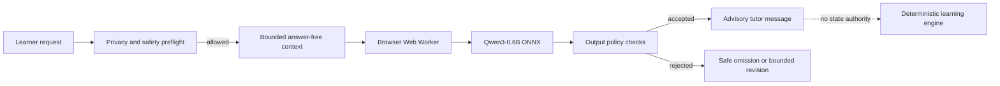

# Misty: browser-local 0.6b

[](#limitations)
[](https://github.com/jacobbabula/bailiwick-misty-qwen3-0.6b/actions/workflows/verify.yml)
[](https://huggingface.co/onnx-community/Qwen3-0.6B-ONNX)

This repository documents the small browser-local language model used by Bailiwick's experimental Misty tutor. It is a model card, integration record, and public evidence boundary—not a release of proprietary application code, prompts, learner data, or model weights.

## At a glance

| Item | Public record |
| --- | --- |
| Base model | `X` |
| Parameter class | 0.6B |
| Execution | Browser Web Worker via Transformers.js + ONNX Runtime Web |
| Acceleration | WebGPU on supported devices |
| Fine-tuning | **None for the generative 0.6B model** |
| Learner data training | None |
| Authority | Advisory text only; deterministic application logic remains authoritative |
| Product status | Experimental / in development |

## What was built

The engineering contribution is the safe product integration around the base model:

- explicit adult-approved model installation;
- browser-local inference with no scripted tutor fallback;
- bounded, answer-free learning context;
- bilingual privacy, crisis, answer-leak, audience, and state-authority preflight;
- deterministic output filtering;
- bounded genuine-model revision for rejected repetitive replies;
- no model access to grading, mastery, publication, or authorization functions.



## Dataset

No learner conversations are used to train the 0.6B model. Public evaluation documentation uses synthetic, non-personal prompts designed around language-learning support, privacy, crisis handling, answer leakage, audience boundaries, context grounding, and repetition.

See [DATASET_CARD.md](DATASET_CARD.md).

## Evaluations

The private release suite passed 137/137 AI contract tests at release commit `b2a1cad257d3310775f0584edd2b0722771ac73e`. A live authenticated family-browser acceptance also exercised the cached Qwen model and observed a materially non-repetitive follow-up with no console errors.

Those results demonstrate the tested integration path. They are not evidence of general pedagogical quality, fairness across learners, or readiness for unrestricted child use. See [EVALUATIONS.md](EVALUATIONS.md).

## Sample outputs

[samples/contract-examples.md](samples/contract-examples.md) contains sanitized public examples of the intended output boundary. They are labeled as contract examples, not verbatim transcripts of a private family session.

## Run the public checks

```bash
git clone https://github.com/jacobbabula/bailiwick-misty-qwen3-0.6b.git
cd bailiwick-misty-qwen3-0.6b
npm test
```

This repository does not download or execute model weights. Reproducing the full private runtime requires the private Bailiwick application and is intentionally out of scope.

## Limitations

- Small and experimental; fluent output can still be wrong or pedagogically weak.
- Browser support, available memory, WebGPU behavior, and generation latency vary by device.
- Automated contract tests do not replace qualified child-safety, privacy, educational-quality, or accessibility review.
- Public examples are sanitized and do not prove live model behavior.
- The model cannot be trusted with grading, placement, mastery, authorization, or publishing.

See [LIMITATIONS.md](LIMITATIONS.md) for the complete boundary.

## Related project

Explore the public product showcase at [Bailiwick Languages](https://jacobbabula.github.io/bailiwick-languages-demo/).

